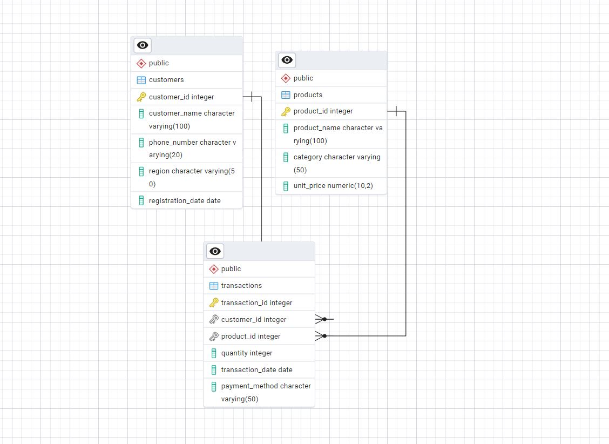
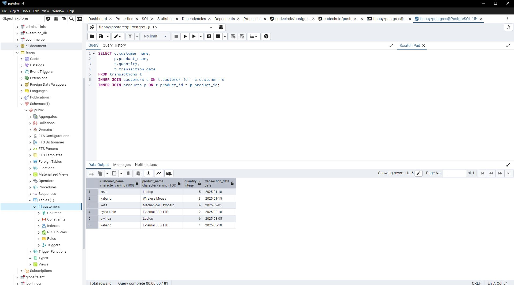
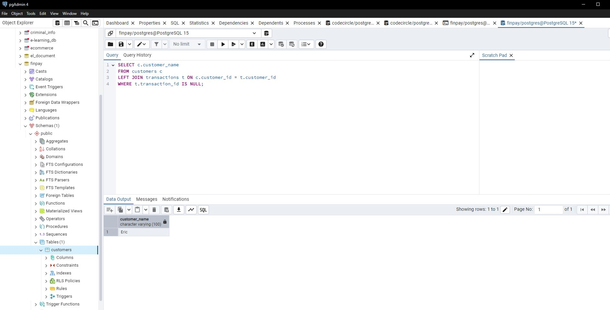
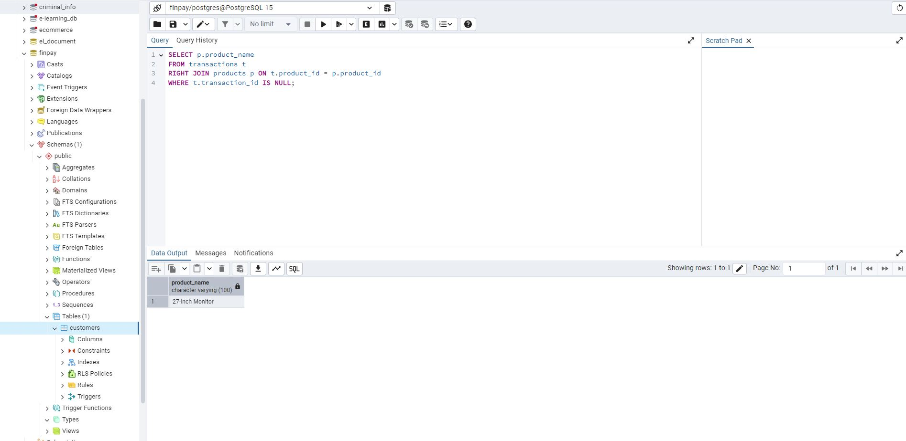
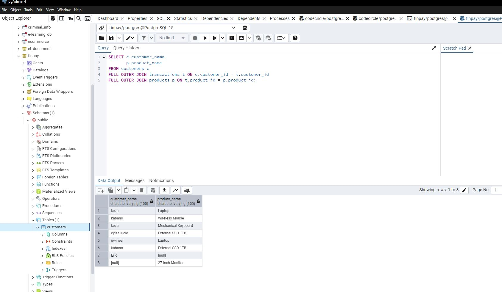
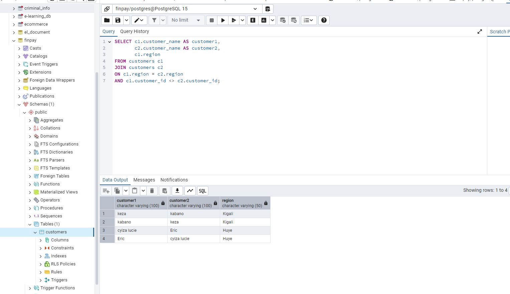
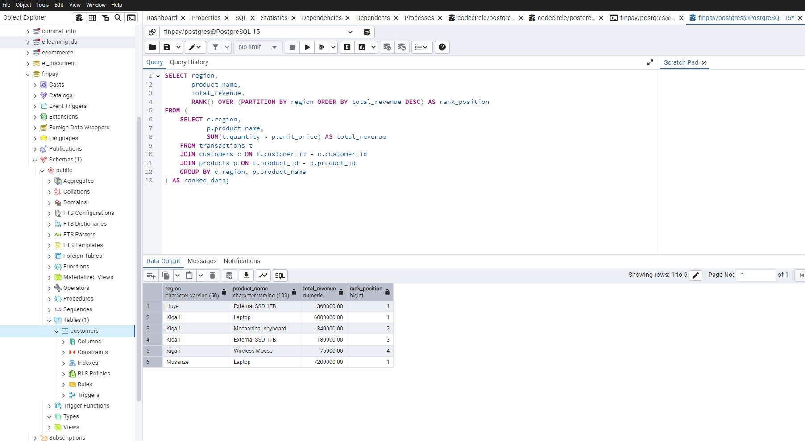
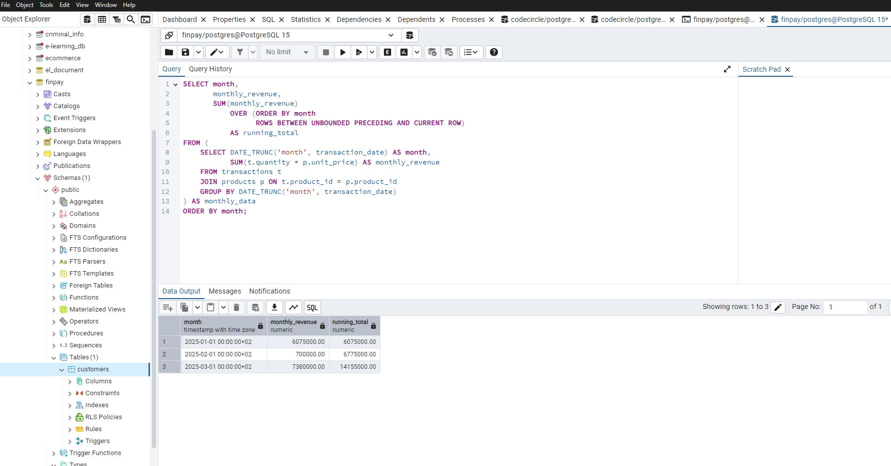
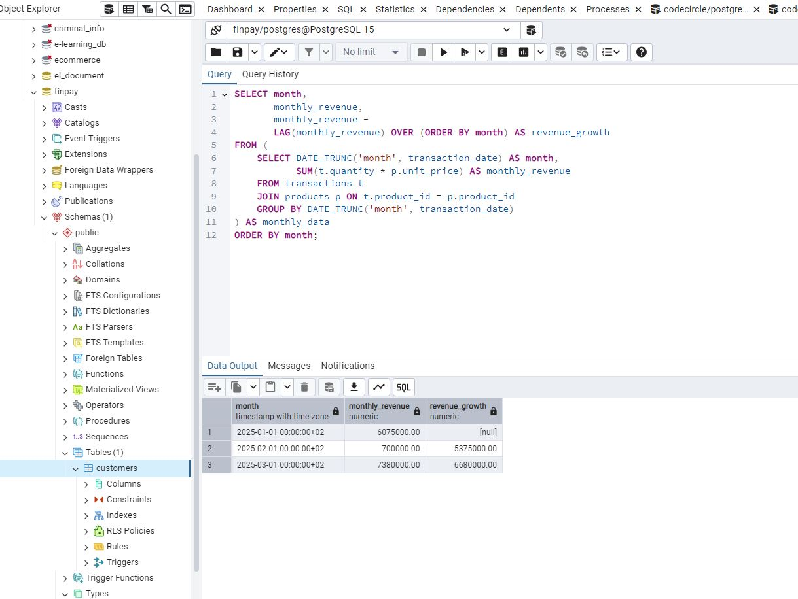
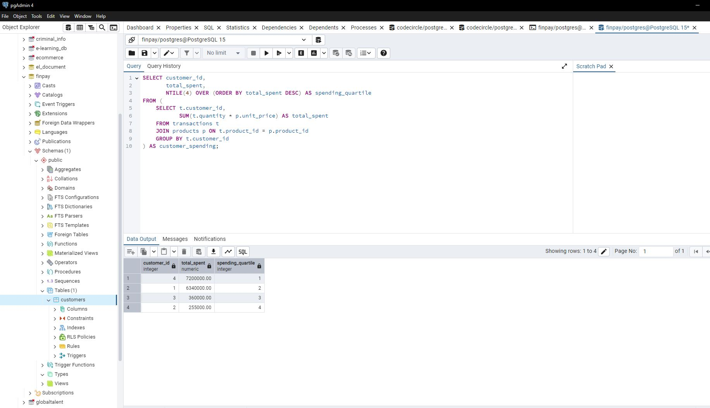

# SQL JOINs & Window Functions Project  
### Course: Database Development with PL/SQL (INSY 8311)  
**Instructor:** Eric Maniraguha  
**Student Name:** KABANO Festo  
**Student ID:** 24725 

# 1. Business Problem

## Business Context  

FinPayConnect is a digital financial platform that enables small-scale sellers to receive mobile money payments from customers using feature phones and smartphones. The platform operates across multiple regions and records customer transactions, product sales, and payment activity.

The Sales & Analytics Department requires structured analytical reporting to evaluate revenue performance, customer behavior, and regional sales distribution to improve strategic decision-making.

## Data Challenge  

Although transactional data is collected daily, the company lacks advanced SQL-based analytical queries to extract business intelligence. Management cannot easily identify:

- Top-performing products by region  
- Revenue growth trends over time  
- High-value and low-value customers  
- Customers with no transactions  
- Products with zero sales activity  

Without structured analysis, strategic planning becomes inefficient.

## Expected Outcome  

This project applies SQL JOINs and Window Functions to generate analytical insights that:

- Identify top products per region  
- Track monthly revenue trends  
- Measure revenue growth patterns  
- Segment customers based on spending behavior  
- Detect inactive customers and unsold products  

These insights support data-driven business decisions.

# 2. Success Criteria

The project achieves the following measurable objectives:

1. Identify **Top 5 revenue-generating products per region** using `RANK()`.
2. Compute **running monthly revenue totals** using `SUM() OVER()`.
3. Calculate **month-over-month revenue growth** using `LAG()`.
4. Segment customers into **four spending quartiles** using `NTILE(4)`.
5. Compute a **three-month moving average revenue trend** using `AVG() OVER()`.

# 3. Database Schema Design

## Tables Implemented

### Customers
- customer_id (Primary Key)  
- customer_name  
- phone_number  
- region  
- registration_date  

### Products
- product_id (Primary Key)  
- product_name  
- category  
- unit_price  

### Transactions
- transaction_id (Primary Key)  
- customer_id (Foreign Key → Customers)  
- product_id (Foreign Key → Products)  
- quantity  
- transaction_date  
- payment_method  

## Entity Relationship Diagram

Customers (1) —— (M) Transactions (M) —— (1) Products  

### ER Diagram Screenshot

# 4. Part A — SQL JOINs Implementation

## INNER JOIN

Retrieves valid transactions with existing customers and products.

---

## LEFT JOIN

Identifies customers who have never made a transaction.

---

## RIGHT JOIN

Detects products with no sales activity.

---

## FULL OUTER JOIN

Compares customers and products including unmatched records.

---

## SELF JOIN

Compares customers within the same region.

---

# Part B — Window Functions Implementation

## Ranking Functions

Use Case: Ranking products by revenue per region.

---

## Aggregate Window Functions

Use Case: Running totals and revenue trends.

---

## Navigation Functions

Use Case: Month-over-month revenue comparison.

## Distribution Functions

Use Case: Customer spending segmentation.

